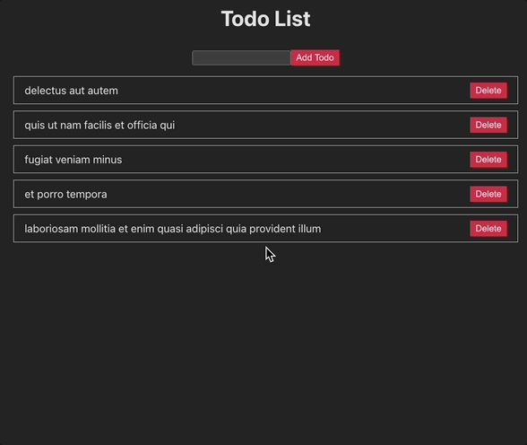

# React Extra Practice

## Todo List App

This guide will walk you through how to build a simple Todo List application using React Function components, state, props, the `useEffect` hook and controlled components to set up forms. allow  with React. When finished, your app will allow the user to add new tasks, view the list of tasks, and delete tasks.



## Setup Instructions

1. Fork this repository
2. Clone your copy of the repository: `git clone <your-repository-url>`
3. Navigate to the project directory: `cd todo-app`
4. Install dependencies: `npm install`
5. Run the app: `npm run dev`

## How To Build It

Once your app is up and running

1. Create two pieces of state in `App.jsx `to keep track of:   
    - the list of Todos
    - the id we'll assign to the next Todo. IDs should be unique, which we can achieve by creating an integer variable that increments every time we add a new item.

    <details><summary>👀 Show Solution</summary>

    ```javascript
    const [todos, setTodos] = useState([]);
    const [nextID, setNextID] = useState(6);
    ```

    </details>

2. Call `useEffect()` in `App.jsx` to fetch some initial Todo data that we can use to populate the page. 
    - JSONPlaceholder has a **todo** endpoint you can use - `https://jsonplaceholder.typicode.com/todos`
    - How many items you use will determine the initial value of the next id described above. The above endpoint provides A LOT of items, you may not want to use all of them.
    
    <details><summary>👀 Show Solution</summary>

    ```javascript
    useEffect(() => {
        // Async-await - create & call a function inside useEffect's callback
        async function fetchTodos() {
        // Fetch initial data from the JSONPlaceholder API
        const response = await fetch('https://jsonplaceholder.typicode.com/todos');
        const data = await response.json();

        const starterTodos = [];
            for(let i=0; i<5; i++) {
            const item = data[i];
            starterTodos.push({
                id: item.id,
                text: item.title,
            });
            }
            setTodos(starterTodos);
        }
        fetchTodos();
    }, []);
    ```

    </details>
3. Create a **components** folder inside of **/src**
4. In the **components** folder, add a new component, `TodoList`. This component...
    - should accept at least two props - the list of Todos and a function to handle deleting a Todo
    - should map over the list of Todos and render a component to display each 

    <details><summary>👀 Show Solution</summary>

    ```javascript
    import Todo from './Todo';

    const TodoList = ({ id, todos, onDelete }) => {
        return (
        <ul>
            {todos.map((todo) => (
            <Todo key={todo.id} id={todo.id} text={todo.text} onDelete={onDelete} />
            ))}
        </ul>
        );
    };

    export default TodoList;
    ```

    </details>

5. In the **components** folder, add a new component, `Todo`, to represent a single Todo item. This component...
    - should accept at least three props - the id of the new Todo, the text describing the new Todo, and the delete function we can use to remove this Todo
    - will display the text of the Todo and a button to delete it. When the button is clicked, the delete function is called with the id passed in as a parameter to enable us to delete the correct Todo 

    <details><summary>👀 Show Solution</summary>

    ```javascript
    const Todo = ({ id, text, onDelete }) => {
        return (
        <li>
            <span>{text}</span>
            <button onClick={() => onDelete(id)}>Delete</button>
        </li>
        );
    };

    export default Todo;
    ```

    </details>

6. In the **components** folder, add a new component, `AddTodoForm`. This component...
    - should accept at least one prop - a function to handle adding a new Todo
    - should provide inputs that allow a user to enter the text of a new Todo
        - remember to "control" your inputs
    - should provide a button that, when clicked, calls the function passed in as a prop and allows a user to add a new Todo

    <details><summary> 👀 Show Solution</summary>

    ```javascript
    import { useState } from 'react';

    const AddTodoForm = ({ onAdd }) => {
        const [todoText, setTodoText] = useState('');
    
        const handleInputChange = (e) => {
        setTodoText(e.target.value);
        };
    
        const handleSubmit = (e) => {
        e.preventDefault();
        if (todoText.trim() !== '') {
            onAdd(todoText);
            setTodoText('');
        }
        };

        return (
            <form onSubmit={handleSubmit}>
            <input type="text" value={todoText} onChange={handleInputChange} />
            <button type="submit">Add Todo</button>
            </form>
        );
    };

    export default AddTodoForm;
    ```

    </details>

7. Add some CSS to style your app however you'd like!
